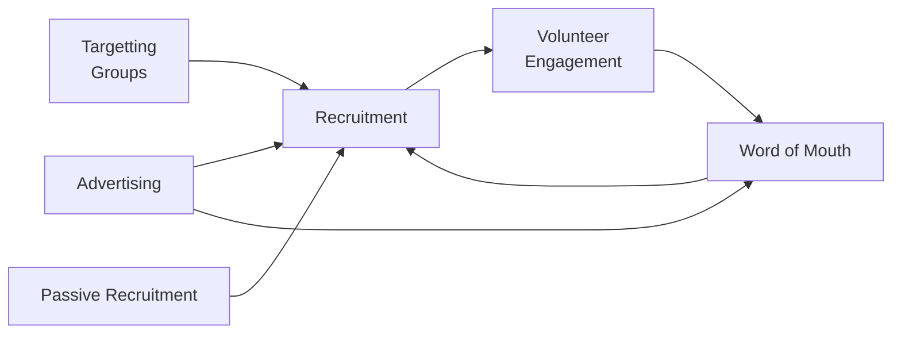

#### Rebuilding Community Connections: Understanding Edmonton's Post-Pandemic Volunteer Landscape
### Links/Further reading
##### AB Gov 2020 research
https://open.alberta.ca/dataset/ab4480ca-ece9-4e1d-93e1-6607ceec1ade/resource/cc32c020-dee5-48db-bd7b-6617e42f334a/download/cmsw-profiling-volunteerism-alberta-nonprofit-voluntary-sector-initiative-discussion-paper-2020.pdf
pg.4
- Volunteering can take many forms. Volunteers are looking for flexibility in how they give their time; as a result, many organizations are offering virtual, group, and employer-supported volunteering opportunities.
- New Canadians are eager to participate in civil society through volunteerism, and are looking to develop skills and networks through volunteer opportunities.
- Youth volunteers are more likely to start and continue volunteering if they feel that they have the right skills and knowledge to do a task.
- Senior volunteers place a high value on being personally asked to provide help to a cause or organization.
- Offering flexibility in how volunteers can participate is crucial for volunteer recruitment and retention.

pg.5
- “time willingly given for the common good and without financial gain.” - Australia
- “A choice to give time or energy, a choice undertaken of one’s own free will and a choice not motivated for financial gain or for a wage or salary." - Scotland

Formal volunteers - attached to a nonprofit
informal assistance -  not attached to a nonprofit
Episodic volunteers - Defined events
Virtual Volunteers - Can be episodic - just means online
pg.31
- gender split pre pandemic to post:
	- Male: 50% -> 36%
	- Female: 51% -> 64%
- Top sections:
	- Food & Necessities: 34%
	- PPE Production: 22%
	- Online Classes & Entertainment: 12%
	- Assisting Seniors: 6%
	- Communications: 6%

##### Rural decline
https://rmalberta.com/wp-content/uploads/2024/10/RuralVolunteerismReport-1.0.pdf
- "It is not an exaggeration to suggest that volunteers are the backbone of rural communities. Volunteers play critical roles within rural FCSS offices, local firefighting and victims services, recreation and cultural organizations, co-operatives, libraries, school councils, churches, municipal committees, and more."
- "Yet, rural volunteer organizations throughout Alberta are struggling with sharply declining volunteer rates."
- "This volunteer shortage, in conjunction with the broader challenges of increasing costs, paperwork, liability concerns, and an increasing need to seek external grants, has placed a wide array of rural volunteer organizations in an extremely vulnerable position."
- "Indeed, it is common today to speak of a “crisis” in volunteering – a situation wherein far fewer people are likely to volunteer at rates consistent with those even a decade ago. Across rural areas in particular, this is now resulting in the “same ten people,” often aging and facing significant stress and burnout, having to increasingly shoulder more and more of the burdens associated with service delivery and facility maintenance in their communities."
- "During the height of the pandemic, in 2021, research collected from the United States Census Bureau “found that formal volunteering dropped more than 23%” from 2019." pg.6

##### Philanthropist
https://thephilanthropist.ca/2023/03/volunteerism-in-crisis-or-at-a-crossroads/
- Raine Liliefeldt, interim CEO of YWCA Canada, sees the post-pandemic level of commitment shifting – for staff as well as volunteers. Workers want a shorter workweek, more flexibility, and better quality of life. She says that employees who were in the pipeline as succession-planning hopefuls are being siphoned off by public- or private-sector employers offering more money and better values alignment.
	- Bottom line: volunteers and staff are simultaneously dealing with their own questions about what they want to invest in, how to stay safe, and how to better align their lives with their values going forward. Our sector cannot ignore this significant mindset shift and must factor this new reality into any re-engagement plans.
- Unlike baby boomers, when young people hear the word “volunteering,” it likely conjures up the hours needed to graduate from high school or meet a particular program requirement. Stroich suggests that young people have been taught to think of time as a commodity, and since volunteering is time, if it is not giving them a payoff, it is not going to get their investment.
- “People volunteer when they have a bigger stake in the outcome,” says Abdul Nakua, a member of the Muslim Association of Canada’s executive team. He says that within his community, helping each other out is part of one’s faith, thus creating a deeper connection than just an obligation to serve. In other words, helping is embedded in community members’ belief system.
- Important as well is the fact that millennials and Gen Zers as a group relate to “community mobilization” and “community care.” We saw their mobilization en masse during the pandemic as they protested threats to social justice. Changing the volunteer language to be more appealing to a younger generation will go a long way toward increasing participation from that demographic.
- When volunteers fall away, employees try or are expected to take on more, leaving staff tired, burning out, or completely burnt out. Because funding dollars do not typically cover strategic redesign of programs, the volunteer fallout becomes intertwined in the HR crisis concurrently plaguing non-profits and charities.
- 
##### Giving report:
https://indd.adobe.com/view/publication/763060b8-d8a0-48c9-8325-c9e619340e9a/51rd/publication-web-resources/pdf/TGR_24_EN_Final.pdf
pg 6:
- For the eleventh year running, the number of Canadians making charitable donations has declined again.
- Service usage is at an all time high.
- There’s a gap between what Canadians say is important to them and the action they are taking
- Disconnected Canadians are less likely to give money and time. Canadians are increasingly disconnected and their social networks have shrunk.
pg.7:
- Strong social connections also foster environmental donations
- People need hope to support the environment.
pg.23:
- Of those with many close friends, 58 percent are at least somewhat hopeful for Canada’s future. Of those with few close friends, only 37 percent are hopeful for Canada’s future.
pg.24:
- At the same time as the number of people donating to charities has decreased, the number of people seeking help from charities has soared. One in five Canadians was using charitable services to meet essential needs in 2023, according to an Ipsos survey commissioned by CanadaHelps — and for almost seven in ten (69 percent), they were doing so for the first time
- These challenges are interconnected, each amplifying the strain on charities that are crucial to providing relief and support across these varied fronts. And for many charities, the impacts of climate change are already increasing pressures on these strained organizations.
pg.37:
- While most charities won’t play a direct role in helping Canadians rebuild social connections, they can help cultivate communities around their cause area. Foster connections and community involvement to strengthen the bond between your organization and potential donors.
- From the CanadaHelps donor and climate survey, 20 percent of former donors to environmental charities stopped giving because of doubts about the effectiveness of their gifts. For charities across causes, but especially those in cause areas that receive a smaller proportion of donations, make sure to highlight not just the needs your organization addresses but also the progress and achievements made possible by donations.
	- Use stories, data, and visuals to make the impact tangible and meaningful to your supporters
- If we are to help the Jessicas in our communities move from caring for a cause to taking action, we need to provide a variety of ways to engage with the cause and feel successful. Encourage involvement beyond financial contributions, such as volunteering, advocacy, or sharing expertise.
- Focus on positive messaging that inspires action. Share success stories and the potential for impact to create a sense of hope and possibility, motivating individuals to contribute to a cause they feel optimistic about.
pg.38:
- Data clearly shows that Canadians are generous during times of crisis, especially when it impacts their local communities. When your organization is responding, consider prompting donors to support the longer-term work as well.
- If your work has been impacted by climate or other crises, incorporate that into your communications. Figure 14 indicates that Canadians aren’t seeing the full picture of crises like climate change on other charitable causes, but crises are a powerful motivator for engagement and giving.

##### Defining what a charitable organization is:
https://www.alberta.ca/register-charitable-organization
A charitable organization is defined as an organization that asks for contributions to be used for a charitable purpose or charitable organization.
A charitable purpose is defined as any purpose that is:
- philanthropic
- benevolent
- educational
- health-oriented
- humane
- recreational
- religious
- cultural
- artistic

##### Seniors Council
https://www.canada.ca/en/national-seniors-council/programs/publications-reports/2010/volunteering-among-seniors/page07.html

##### My Ideas
- Much of the stats we have is pre-covid which does not give a full picture of what volunteerism is like post-covid
- "lower" positions are hard to fill. As in they will almost always go empty
- "higher" positions have way too many candidates. As in, we have an extraordinary abundance
- HR Gap? I think this talks about small organizations who do not have a way of being able to fully devote time to HR
- There is a steady supply of university Gen Z's who have an idea that they volunteer directly for hours. Because of this transactional mindset they will typically go out and find opportunities. 
	- The only thing that can be used to increase the amount of volunteers is effective advertising and word of mouth
- There is also a steady supply of retired folks ready to volunteer, but they need to be directly reached out to
	- Here there's a lot of room
- In between these ages we see less people volunteering without overt reasons.
	- Ex. Their kid is volunteering, or perhaps they need professional hours
	- This is not an issue, as these individuals are focused on their careers, children, etc
- We should focus on factors that focus on senior volunteer engagement.
	- Especially covariant factors

##### Background

The nonprofit sector of Alberta's experiencing new trends and exacerbation of old ones. Currently we're seeing declines in the number of Canadians making charitable donations, that some Canadians are feeling more disconnected and not giving money or time, and increased service usage (Giving survey, 2024). Given these new changes there needs to be adaptation and new techniques used by nonprofits to engage communities.

Previously recruiting volunteers entailed a rough strategy consisting of:

From my own personal experience i've found the following to be generally true:
- A majority of the volunteer work is done by a minority of volunteers who are highly engaged
- Consistent community engagement is extremely difficult on coordinators. I've noticed most organizations work in phases or campaigns instead of constantly keeping up pressure.
- It's better to target certain populations instead of casting a wide of net as possible.
	- Ex. leadership groups, or certain student groups

Currently the nonprofit sector is facing a variety of changes that each organization can fit into:
1) They are receiving decreased donations in past years
2) They are receiving the same or more in donations from a smaller group of individuals

College age individuals need little reason or request to begin or try to apply volunteering. Seniors need genuine outreach to volunteer. Individuals in between might not volunteer unless they have an explicit reason to as in they truly want to volunteer there or they need professional hours.

##### Discussion
We know from the Giving Report that people volunteer when they feel connected and are able to see direct results - hence why environmental factors were focused upon as the results are typically not immediate and potentially less tangible. For other organizations not in environment, the decline in consecutiveness means more isolation for seniors. Since we cannot literally reach out to every senior in isolation, we must go through large community groups and have them distribute volunteering opportunities.

The pandemic has caused a lot of isolation and potentially even decline. If there's documented analysis we can make the following two hypothesis where one is based in the recent term, and one is focused on long term effects:
1) Post-Pandemic will show, we can expect to see a decrease in volunteerism due to isolation and we can see an increase in intensity in volunteering due to the intentionality behind volunteering for the community.
To make 1) disprovable, we will try to look through the most recent data, but we will fully understand this effect once the most recent Giving, Volunteering and Participating (GVP) survey based on 2024 data is released. At best, we can predict the falsifiability of this statement until the survey is released

2) Economically, we can potentially see a similar effect. Given Alberta is a resource economy definitionally it will experience large booms and large busts that is pegged directly to the value of resources. Potentially in these bust cycles we can see the same effects.
For 2) to be disprovable we can look at the data taken from 2009 and 2015 - 2016 during two Alberta recessions in the 21st century. Here we can find a more direct correlation.

##### Notes:
Your first hypothesis addresses an important paradox in post-pandemic volunteerism that the data hints at but hasn't fully captured yet. The AB Gov report and Philanthropist article both suggest this tension between isolation and intentionality. Here's how we might sharpen the hypothesis:

Hypothesis 1 (Isolation-Intensity Paradox): "Post-pandemic volunteerism will show two simultaneous but opposing trends: decreased overall participation due to disrupted social networks, but increased hours/commitment from those who do volunteer due to heightened awareness of community needs."

This is theoretically grounded because:

- The Giving Report shows declining social connections correlate with reduced volunteering
- The shift in gender distribution (50/50 to 36/64) suggests fundamental changes in who volunteers
- The "same ten people" phenomenon in rural communities indicates intensification among committed volunteers

Your second hypothesis about economic cycles is particularly relevant for Alberta. I'd suggest framing it this way:

Hypothesis 2 (Resource Economy Volunteer Cycle): "Volunteer patterns in resource-dependent economies follow a counter-cyclical pattern, with formal volunteering decreasing during economic downturns while informal community support increases."

This builds on:

- Historical data from previous resource busts
- The documented increase in service demands during economic downturns
- The shift between formal and informal volunteering noted in the AB Gov report

# Methods
Currently we're working on outdated information based on the Giving Survey. The most recent raw data we have is based on the Government of Alberta's 2023 Online survey. This survey is extremely broad, but contains sections based on volunteerism and we ahave around 600 responses for volunteer-related items so it is currently the best we have.

In cleaning the data I replaced the questions with the guidebook, then I simplified the questions. Notably right after this wecan see the following:

